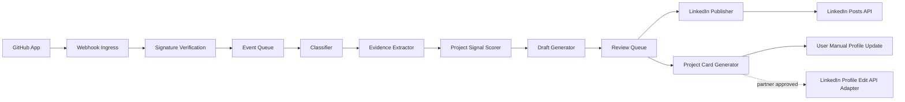
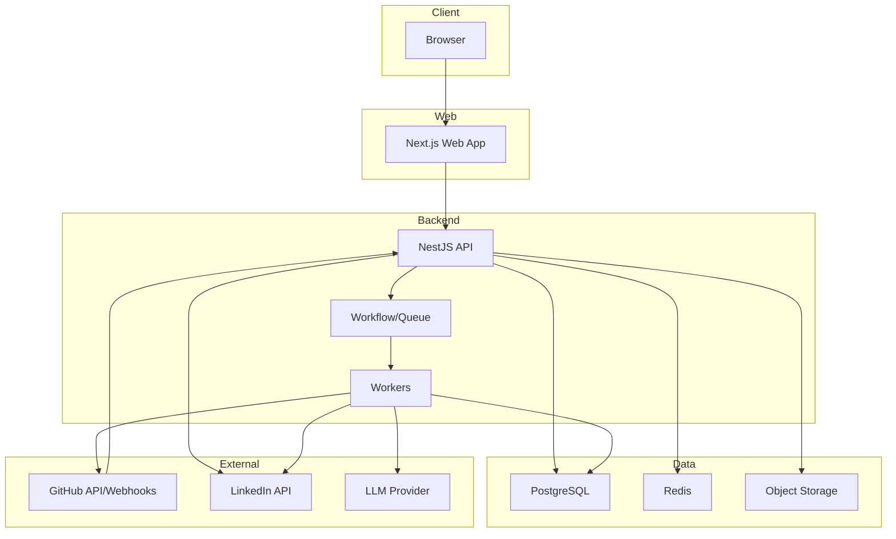
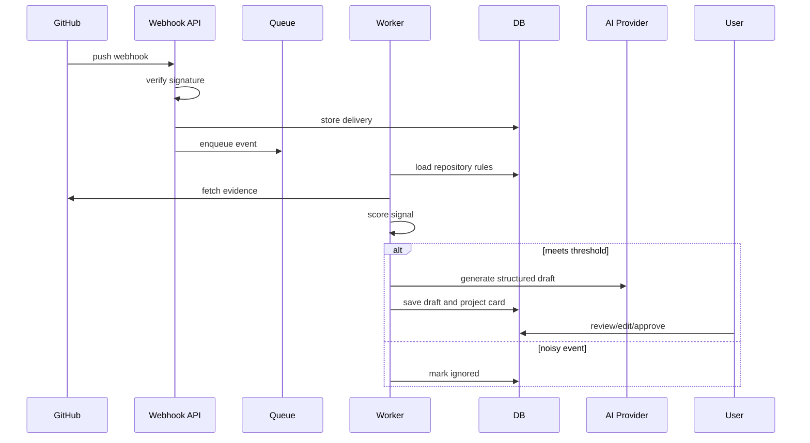
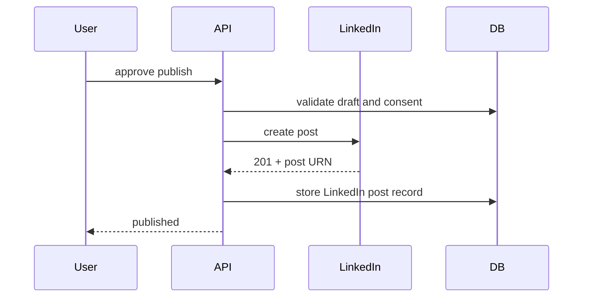

# System Architecture

## Architecture Principle

Design for negentropy: every GitHub event should make the user's professional profile data more structured, accurate, and reusable. Avoid entropy by rejecting noisy automation, unofficial LinkedIn behavior, and one-off scripts that will break when APIs change.

Entropy means the natural tendency of systems toward decay, disorder, and complexity without value. Negentropy means deliberate reversal of decay through growth, compounding value, and increasing order. Tacit knowledge means unwritten assumptions and workarounds that make the system function but are not documented. RepoSignal should externalize tacit knowledge into rules, quality gates, logs, and content memories.

## Capability Boundary

| Capability | MVP | Later |
|---|---:|---:|
| Connect GitHub | Yes | Yes |
| Receive GitHub webhooks | Yes | Yes |
| Analyze repo/project signals | Yes | Yes |
| Draft LinkedIn posts | Yes | Yes |
| Publish LinkedIn posts through official API | Yes | Yes |
| Generate LinkedIn Projects section fields | Yes | Yes |
| Auto-edit LinkedIn Projects section | No | Only with approved LinkedIn Profile Edit API access |
| Browser automation/scraping | No | No |

## High-Level System



## Deployment Topology



## Recommended Stack Details

### Monorepo

- pnpm workspaces
- Turborepo
- TypeScript strict mode
- Biome or ESLint plus Prettier
- Changesets for package versions if public SDKs are added

### Frontend

- Next.js App Router
- React
- TypeScript
- Tailwind CSS
- shadcn/ui
- lucide-react
- TanStack Query
- React Hook Form
- Zod
- Zustand only for small local UI state

### Backend

- NestJS with Fastify adapter
- Prisma ORM
- PostgreSQL
- Redis and BullMQ for MVP background jobs
- Temporal or Inngest when workflows need durable retries, human waits, and long-running orchestration
- Octokit for GitHub
- Official LinkedIn REST APIs

### AI Layer

Use a provider abstraction:

- `ContentModelProvider`
- `EmbeddingProvider`
- `SafetyCheckProvider`
- `ImageProvider`

Do not hard-code the provider into domain logic. The content pipeline should accept evidence and output structured JSON first, then render text from that JSON.

### Infrastructure

MVP:

- Vercel: web
- Fly.io or Render: API and workers
- Neon/Supabase: Postgres
- Upstash: Redis
- Cloudflare R2 or AWS S3: media assets
- Sentry: exceptions
- PostHog: product analytics

Scale:

- AWS ECS/Fargate or Kubernetes
- RDS Postgres
- ElastiCache Redis
- S3
- OpenTelemetry collector
- Datadog/Axiom/Grafana

## Core Services

### Identity Service

Responsibilities:

- User accounts.
- Sessions.
- Workspaces.
- Role-based access.
- OAuth account linking.

Recommendation:

- Auth.js for self-managed control, or Clerk for faster SaaS launch.
- Store integration tokens in a separate encrypted token vault table.

### GitHub Integration Service

Responsibilities:

- GitHub App installation lifecycle.
- Webhook verification.
- Repository sync.
- Installation access token generation.
- Repo evidence extraction.

Events to support first:

- `installation`
- `installation_repositories`
- `push`
- `pull_request`
- `release`
- `repository`

Security:

- Verify `X-Hub-Signature-256` with HMAC-SHA256.
- Store webhook deliveries idempotently by delivery ID.
- Reject unsigned or replayed payloads.

### Signal Service

Responsibilities:

- Convert raw GitHub events into meaningful project signals.
- Score the repo and event.
- Decide whether to create a draft, project card, both, or nothing.

Example scoring:

| Signal | Points |
|---|---:|
| README meaningful | 15 |
| Demo URL exists | 15 |
| Release published | 20 |
| Tests/CI present | 10 |
| Screenshots/docs present | 10 |
| Significant merged PR | 15 |
| Repo description/topics present | 10 |
| Duplicate/noisy event | -30 |
| Secret or private-risk flag | -100 |

Draft threshold:

- 45: suggest project card.
- 60: suggest post draft.
- 80: eligible for autopilot if user allows.

### Evidence Service

Responsibilities:

- Fetch README.
- Fetch repo metadata.
- Fetch language breakdown.
- Fetch recent commits.
- Fetch PR/release data.
- Extract file tree summaries.
- Detect secrets or sensitive names.

Store only what is needed. For private repos, cache minimal summaries and give users clear deletion controls.

### Content Generation Service

Responsibilities:

- Generate structured project summary.
- Generate LinkedIn post variants.
- Generate hashtags.
- Generate project card fields.
- Run safety and hallucination checks.

Output contract:

```json
{
  "projectName": "string",
  "post": {
    "hook": "string",
    "body": "string",
    "hashtags": ["string"],
    "cta": "string",
    "fullText": "string"
  },
  "projectCard": {
    "title": "string",
    "role": "string",
    "description": "string",
    "startDate": "YYYY-MM",
    "endDate": null,
    "technologies": ["string"],
    "links": [{ "type": "github|demo|docs", "url": "string" }]
  },
  "evidenceMap": [
    { "claim": "string", "sourceType": "readme|commit|pr|release|repo", "sourceUrl": "string" }
  ],
  "riskFlags": ["string"]
}
```

### Review Service

Responsibilities:

- Draft queue.
- Version history.
- User edits.
- Approval state.
- Scheduling.
- Brand voice learning.

### LinkedIn Publisher

Responsibilities:

- OAuth token use and refresh handling.
- Create posts through official API.
- Upload media before post creation where required.
- Store LinkedIn returned URNs.
- Handle duplicate, throttle, permission, and validation errors.

Post payload baseline:

```json
{
  "author": "urn:li:person:{id}",
  "commentary": "Generated post text",
  "visibility": "PUBLIC",
  "distribution": {
    "feedDistribution": "MAIN_FEED",
    "targetEntities": [],
    "thirdPartyDistributionChannels": []
  },
  "lifecycleState": "PUBLISHED",
  "isReshareDisabledByAuthor": false
}
```

### Profile Project Adapter

MVP:

- Generate project cards only.
- Let user copy fields and open LinkedIn profile.
- Track manual completion.

Partner-approved:

- Adapter interface:

```ts
interface ProfileProjectAdapter {
  createProject(input: ProjectCardInput): Promise<ProjectSyncResult>;
  updateProject(projectId: string, input: Partial<ProjectCardInput>): Promise<ProjectSyncResult>;
  deleteProject(projectId: string): Promise<void>;
}
```

Default implementation:

- `ManualProjectAdapter`

Future implementation:

- `LinkedInProfileEditAdapter`

## Database Model

Core tables:

- `users`
- `workspaces`
- `workspace_members`
- `oauth_accounts`
- `token_vault_entries`
- `github_installations`
- `repositories`
- `repository_rules`
- `webhook_deliveries`
- `repo_events`
- `project_signals`
- `evidence_snapshots`
- `content_drafts`
- `draft_versions`
- `project_cards`
- `publish_jobs`
- `linkedin_posts`
- `brand_voices`
- `audit_logs`
- `prompt_versions`
- `usage_events`

Important fields:

```prisma
model Repository {
  id              String   @id @default(cuid())
  workspaceId     String
  githubRepoId    BigInt   @unique
  owner           String
  name            String
  fullName        String
  visibility      String
  defaultBranch   String?
  htmlUrl         String
  enabled         Boolean  @default(true)
  autoMode        String   @default("REVIEW_REQUIRED")
  lastSyncedAt    DateTime?
  createdAt       DateTime @default(now())
  updatedAt       DateTime @updatedAt
}

model ContentDraft {
  id              String   @id @default(cuid())
  workspaceId     String
  repositoryId    String
  signalId        String?
  status          String
  postType        String
  fullText        String
  structuredJson  Json
  evidenceMap     Json
  riskFlags       Json
  scheduledFor    DateTime?
  approvedById    String?
  createdAt       DateTime @default(now())
  updatedAt       DateTime @updatedAt
}

model ProjectCard {
  id              String   @id @default(cuid())
  workspaceId     String
  repositoryId    String
  title           String
  role            String?
  description     String
  startDate       String?
  endDate         String?
  technologies    Json
  links           Json
  syncStatus      String   @default("MANUAL_READY")
  linkedInProjectId String?
  createdAt       DateTime @default(now())
  updatedAt       DateTime @updatedAt
}
```

## API Surface

### Public/Auth

- `POST /auth/sign-in`
- `POST /auth/sign-out`
- `GET /auth/session`

### GitHub

- `POST /integrations/github/webhook`
- `GET /integrations/github/installations`
- `POST /integrations/github/sync`
- `GET /repositories`
- `PATCH /repositories/:id/rules`

### LinkedIn

- `GET /integrations/linkedin/connect`
- `GET /integrations/linkedin/callback`
- `POST /integrations/linkedin/disconnect`
- `POST /linkedin/posts/:draftId/publish`
- `POST /linkedin/posts/:draftId/schedule`

### Drafts

- `GET /drafts`
- `GET /drafts/:id`
- `POST /drafts/generate`
- `PATCH /drafts/:id`
- `POST /drafts/:id/approve`
- `POST /drafts/:id/regenerate`
- `POST /drafts/:id/skip`

### Project Cards

- `GET /project-cards`
- `POST /project-cards/generate`
- `PATCH /project-cards/:id`
- `POST /project-cards/:id/mark-added`
- `POST /project-cards/:id/sync` only if partner adapter enabled

### Audit

- `GET /audit-logs`
- `GET /webhook-deliveries`
- `POST /data-export`
- `DELETE /account`

## Workflow Details

### Push Event



### Publish Event



## Security Requirements

- Encrypt OAuth tokens at rest with envelope encryption.
- Never log access tokens, refresh tokens, webhook secrets, or private repo content.
- Verify GitHub webhook signatures before parsing business logic.
- Use least-privilege GitHub App permissions.
- Provide user data export and deletion.
- Add audit logs for every publish, token change, repo rule change, and project sync attempt.
- Use rate limits for all public endpoints.
- Run secret scanning on evidence before content generation.
- Support workspace-level access control before team features launch.

## Failure Modes

| Failure | Mitigation |
|---|---|
| GitHub webhook duplicate | Store delivery ID and make processing idempotent |
| GitHub webhook signature invalid | Reject request |
| LinkedIn token expired | Refresh or ask user to reconnect |
| LinkedIn duplicate post error | Show draft as duplicate and suggest edit |
| LinkedIn permission missing | Disable publish and show reconnect instructions |
| AI hallucinated claim | Evidence map and safety checker block approval |
| Too many noisy commits | Signal threshold and aggregation windows |
| Private repo leaks | Private repo privacy mode, redaction, manual approval only |
| Profile Project API unavailable | ManualProjectAdapter remains default |

## Non-Functional Targets

- Webhook acknowledgement: under 2 seconds.
- Draft generation: under 60 seconds for normal repos.
- Publish action: under 10 seconds excluding LinkedIn media processing.
- Availability: 99.5 percent MVP, 99.9 percent later.
- RPO: 15 minutes.
- RTO: 2 hours MVP.

